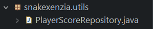
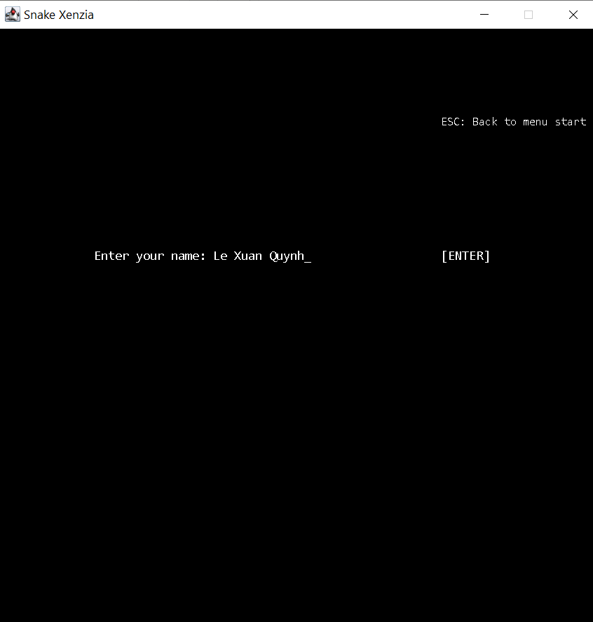

**BÀI TẬP LỚN MÔN CÔNG NGHỆ JAVA**

ĐỀ TÀI: LẬP TRÌNH GAME SNAKE XENZIA

Giảng viên hướng dẫn: Vũ Huấn

| **Mã sinh viên** | **Họ và tên** |
| --- | --- |
| 201200309 | Lê Xuân Quỳnh |

**Hà Nội, tháng 4 năm 2021**

# LỜI MỞ ĐẦU

Snake Xenzia là game Rắn săn mồi huyền thoại trên các dòng máy điện thoại cục gạch thời những năm 2000 - 2008. Nếu bạn đã từng là học sinh phổ thông trong giai đoạn này thì chắc hẳn bạn sẽ không quên cơn sốt lập kỷ lục game rắn săn mồi. Mỗi giờ ra chơi, mỗi buổi học thêm, mỗi lần học quân sự hay thậm chí là trong lớp học. Khó ai có thể quên được giai đoạn đó.

Để hiểu sâu hơn về tựa game yêu thích một thời và để củng cố thêm kiến thức về lập trình, em quyết định chọn game Snake Xenzia làm chủ đề bài tập lớn môn Công nghệ Java của mình. Do chưa có kinh nghiệm làm game cũng như chưa làm quen được hoàn toàn với nhiều kiến thức mới nên bài làm của em không thể tránh khỏi các thiếu sót. Vì vậy rất mong nhận được góp ý của thầy để củng cố thêm được nhiều kiến thức và hoàn thiện đề tài hơn nữa.

# MỤC LỤC

[LỜI MỞ ĐẦU](#lời-mở-đầu)

[MỤC LỤC](#mục-lục)

[I. Giới thiệu bài toán](#i-giới-thiệu-bài-toán)

[1\. Lịch sử game](#lịch-sử-game)

[2\. Yêu cầu bài toán](#yêu-cầu-bài-toán)

[3\. Luật chơi](#luật-chơi)

[4\. Chức năng](#chức-năng)

[II. Các Package và Class](##ii-các-package-và-class)

[1\. Package Model](#package-model)

[2\. Package View](#package-view)

[3\. Package Controller](#package-controller)

[4\. Package Utils](#package-utils)

[III. Thiết kế](#iii-thiết-kế)

[1\. Giao diện](#giao-diện)

[a. Giao diện nhập tên](#giao-diện-nhập-tên)

[b. Giao diện danh sách điểm cao nhất](#giao-diện-danh-sách-điểm-cao-nhất)

[c. Giao diện cài đặt](#giao-diện-cài-đặt)

[2\. Database](#database)

[3\. Đọc/ghi file](#đọcghi-file)

[IV. Kết luận và đánh giá](#kết-luận-và-đánh-giá)

[1\. Kết quả đạt được](#kết-quả-đạt-được)

[2\. Hạn chế](#hạn-chế)

[3\. Hướng phát triển trong tương lai](#hướng-phát-triển-trong-tương-lai)

# I. Giới thiệu bài toán

## Lịch sử game

- Sự tồn tại của bất cứ tựa Game Mobile nào ngày nay sẽ đều là vỗ nghĩa nếu quên nhắc đến Snake - "Rắn săn mồi". Đó là khẳng định hoàn toàn chắc chắn, đặc biệt khi bạn nhìn vào lịch sử làng Game Mobile qua những hình ảnh đen trắng hết sức sơ khai, nhưng mở đường cho cả một ngành công nghiệp hằng chục tỷ USD sau đó. Sự xuất hiện của Snake trên chiếc máy Nokia 6110 (1997) có lẽ chẳng gây nhiều chú ý vào thời điểm chào sân, nhưng nó lại trở thành cội nguồn cho một đế chế giải trí đang lên ở thời điểm hiện tại.
- Được cài đặt trên 350 triệu điện thoại tính đến năm 2005, tựa game đơn giản nhưng gây nghiện Snake đã trở thành một hiện tượng trên toàn thế giới, cho cộng đồng khắp nơi biết đến "hương vị" đầu tiên của một tựa Game Mobile, châm ngòi cho một dòng thiết bị mang tính cách mạng mà bây giờ hiện diện trong mọi khía cạnh cuộc sống.

## Yêu cầu bài toán

- Xây dựng một bản đồ game như một ma trận có kích thước 30 x 30, mỗi ô của ma trận có kích thước 20 x 20. Trong đó có các đối tượng là: Rắn, thức ăn, bức tường.
- Nhiệm vụ của người chơi là điều khiển Rắn bằng các phím W(đi lên), A(sang trái), S(xuống dưới), D(sang phải) để di chuyển quanh bản đồ, né tránh các bức tường và ăn thức ăn và kiếm được số điểm cao nhất.
- Khi rắn ăn thức ăn thì chiều dài của rắn sẽ tăng lên một đơn vị và thức ăn sẽ được tạo ra ở một vị trí mới quanh bản đồ nhưng vị trí đó phải khác vị trí đặt các bức tường và vị trí của con rắn.
- Có 4 bức tường ở 4 góc của bản đồ. Có tuỳ chọn để tắt các bức tường và làm cho rắn đi xuyên qua được từ bên này sang bên kia.
- Khi đầu rắn va chạm vào tường hoặc đầu rắn va chạm với thân rắn thì game sẽ kết thúc
- Có thể điều chỉnh tốc độ chơi làm cho game nhanh lên hoặc chậm đi

## Luật chơi

- Tạo ra một ma trận tĩnh (kích thước 600x600) có các vật cản cố định và thức ăn sinh ngẫu nhiên
- Hành động của rắn: Khi người chơi chọn nút PLAY thì rắn bắt đầu di chuyển, người chơi di chuyển rắn bằng các nút ảo W (lên trên), A(sang trái), S(xuống dưới), D(sang phải) sao cho rắn ăn được thức ăn và không bị đâm vào vật cản. Trên cùng một đường thẳng rắn không thể quay đầu lại.
- Độ dài rắn: Sau khi ăn thức ăn, độ dài rắn tăng thêm một đơn vị
- Điểm: Được cộng 1 điểm sau mỗi lần rắn ăn thức ăn
- Mỗi khi rắn va vào tường hoặc va chạm với bản thân nó thì game sẽ kết thúc.
- Khởi tạo:
  - Tại thời điểm ban đầu, rắn được sinh ra ở giữa bản đồ với vị trí đầu rắn là (head.x, head.y) = (300, 300)
  - Thức ăn được sinh ra ngẫu nhiên: sinh ra từng thức ăn một, khi rắn ăn hết thức ăn này sẽ sinh ngẫu nhiên thức ăn mới sao cho vị trí thức ăn mới không trùng với vị trí các bức tường và vị trí của rắn
- Va chạm:
  - Khi rắn ăn được thức ăn: Vị trí đầu rắn trùng với vị trí thức ăn
  - Khi rắn chết: Vị trí đầu rắn trùng với vị trí của phần thân rắn hoặc vị trí đầu rắn trùng với vị trí của các bức tường
- Di chuyển: Đổi vị trí phần đầu rắn ở ô hiện tại sang vị trí các ô liền kề, xoá vị trí phần đuôi rắn làm cho rắn có vẻ như đang di chuyển theo một hướng nào đấy
  - Rắn di chuyển lên trên: Đổi vị trí đầu rắn thành (head.x, head.y - 20). Xoá vị trí đuôi rắn.
  - Rắn di chuyển sang trái: Đổi vị trí đầu rắn thành (head.x - 20, head.y). Xoá vị trí đuôi rắn.
  - Rắn di chuyển xuống dưới: Đổi vị trí đầu rắn thành (head.x, head.y + 20). Xoá vị trí đuôi rắn.
  - Rắn di chuyển sang phải: Đổi vị trí đầu rắn thành (head.x + 20, head.y). Xoá vị trí đuôi rắn.
- Tăng trưởng: Xuất hiện khi rắn ăn thức ăn. Đổi vị trí phần đầu rắn ở ô hiện tại sang vị trí các ô liền kề, nhưng không xoá vị trí phần đuôi rắn.
  - Rắn di chuyển lên trên: Đổi vị trí đầu rắn thành (head.x, head.y - 20
  - Rắn di chuyển sang trái: Đổi vị trí đầu rắn thành (head.x - 20, head.y
  - Rắn di chuyển xuống dưới: Đổi vị trí đầu rắn thành (head.x, head.y + 20)
  - Rắn di chuyển sang phải: Đổi vị trí đầu rắn thành (head.x + 20, head.y)

## Chức năng

- **Bên ngoài game:**

- Start game: Bắt đầu game
- List score: Liệt kê 5 người người chơi có điểm cao nhất theo thứ tự giảm dần
- Setting: Cài đặt các tuỳ chọn trong game
- Quit game: Thoát game
- **Bên trong game:**
- Nhập tên trước khi chơi để ghi danh vào danh sách điểm cao nhất
- Tạm dừng game
- Quay trở lại màn hình bên ngoài game

# II. Các Package và Class

## Package Model

- Dùng để chứa các đối tượng của game và logic game

- **Class Food**
- Dùng để chứa thông tin về đối tượng Food
- Các thuộc tính:
  - x: là toạ độ x của thức ăn trong ma trận
  - y: là toạ độ y của thức ăn trong ma trận
  - color: chứa giá trị màu của thức ăn
- Các phương thức:
  - Hàm tạo: Gọi đến hàm randomSpawn, dùng để tạo vị trí ngẫu nhiên khi khởi tạo thức ăn
  - get/set – dùng để lấy giá trị và sửa đổi giá trị của các thuộc tính bên trên
  - randomSpawn: Dùng để tạo vị trí ngẫu nhiên cho thức ăn
- **Class Snake**
- Dùng để chứa thông tin về đối tượng Snake
- Các thuộc tính:
  - body: Là mảng chứa vị trí từng phần của con rắn
  - head: Là đối tượng chứa vị trí đầu con rắn
  - direction: Là biến xác định hướng di chuyển của con rắn
  - colors: Là mảng chứa giá trị màu ứng với từng phần của con rắn
- Các phương thức:
  - Hàm tạo: Khởi tạo con rắn có kích thước là 2, toạ độ đầu rắn là (300, 300). Đầu rắn màu đỏ, đuôi rắn màu xanh lá cây
  - get/set – dùng để lấy giá trị và sửa đổi giá trị của các thuộc tính bên trên
  - move: Dùng để di chuyển rắn
  - grow: Dùng để tăng trưởng rắn
- **Class Game**
- Dùng để thực hiện các logic game
- **Class PlayerScore**
- Dùng để chứa thông tin các bản ghi trong database

## Package View

- Dùng để chứa phần giao diện của game

- **Class GameGraphics**
- Là một panel, dùng xử lí đồ hoạ cho các đối tượng và các dòng chữ trong game
- **Class GameWindows**
- Là một frame, dùng để khởi tạo một cửa sổ game

## Package Controller

- Dùng để chứa phần điều khiển game (bàn phím)

- **Class MyKeyAdapter**
- Là một KeyListener, dùng để bắt sự kiện khi nhấn phím, để tương tác với trò chơi

## Package Utils

- **Class PlayerScoreRepository**
- Dùng để tương tác với database với các phương thức:

+, readTop5HighestScore: Lấy ra 5 người chơi có điểm cao nhất từ database

+, add: Thêm một bản ghi mới vào database

+, delete: Xoá một bản ghi trong database

# III. Thiết kế

## Giao diện

- **Giao diện bắt đầu**
- Hình bên dưới là giao diện bắt đầu của chương trình:

- Giao diện có 4 tuỳ chọn tương ứng với 4 phím là:

+, Phím ENTER: là phím bắt đầu trò chơi. Khi bấm phím này chương trình sẽ chuyển người dùng vào _Giao diện nhập tên_

+, Phím L: là phím liệt kê danh sách 5 người đạt điểm cao nhất theo thứ tự giảm dần. Khi bấm phím này, chương trình sẽ chuyển người dùng vào _Giao diện danh sách điểm cao nhất_

+, Phím S: là phím cài đặt game. Khi bấm phím này, chương trình sẽ chuyển người dùng vào _Giao diện cài đặt_

+, Phím Q: là phím thoát game. Khi bấm phím này thì chương trình sẽ đóng lại

### Giao diện nhập tên

- Tại giao diện nhập tên, người dùng thao tác với các phím chữ từ a-z và từ A-Z để nhập tên của mình, thao tác với phím ESC để quay trở lại Giao diện bắt đầu. Sau khi nhập xong thì bấm phím ENTER, chương trình sẽ chuyển người dùng vào _Giao diện chơi game_
- **Giao diện chơi game**

- Tại giao diện chơi game, thông tin về số điểm được hiển thi ở góc trái màn hình. Khi đang chơi, người dùng có thể bấm phím P để pause game. Khi pause game thì một _Giao diện tạm dừng trò chơi_ sẽ hiển thị ra
- **Giao diện tạm dừng trò chơi**

- Để chơi tiếp, người dùng bấm phím P. Hoặc có thể bấm phím ESC để thoát ra màn hình bắt đầu

### Giao diện danh sách điểm cao nhất

- Tại đây hiển thị danh sách 5 người đạt điểm cao nhất theo thứ tự giảm dần. Người dùng có thể bấm phím ESC để quay trở lại màn hình bắt đầu.

### Giao diện cài đặt

- Đây là nơi để tuỳ chỉnh các cài đặt trong game.
- Người dùng có thể chỉnh tốc độ (Speed) của rắn. Có 3 tốc độ rắn là chậm (1), bình thường (2), nhanh (3). Người dùng có thể bấm các phím số 1 2 3 để chỉnh tốc độ mà mình mong muốn, tốc độ được chọn sẽ được bôi đỏ để người dùng dễ nhận biết

Người dùng có thể tuỳ chỉnh chế độ chơi cho rắn có thể xuyên tường hoặc không xuyên tường. Bấm phím E (Enable) để bật xuyên tường và D (Disable) để tắt xuyên tường

+, Khi bật xuyên tường thì rắn có thể đi xuyên từ đầu bên này sang đầu bên kia:

+, Khi tắt xuyên tường thì Giao diện chơi game sẽ có thêm 4 bức tường ở 4 cạnh:

## Database

- Dùng để lưu điểm của người chơi.
- Hệ quản trị cơ sở dữ liệu được sử dụng trong bài là MySQL
- Cơ sở dữ liệu gồm một bảng với các thuộc tính:

id: int – Là số thứ tự của bản ghi

name: varchar – Là tên người chơi

score: int – Là điểm người chơi ghi được

Khoá chính: id

## Đọc/ghi file

- Dùng để lưu trữ cài đặt trong game, được lưu vào file setting.txt. Trong đó:

+, Dòng đầu lưu tốc độ game (int)

+, Dòng thứ hai lưu xem có bật xuyên tường hay không (boolean)

- Mặc định file này sẽ lưu:

50

false

Tương ứng với việc tốc độ game là 50 và không bật xuyên tường

- Khi mở game, file setting.txt sẽ tự động được đọc. Khi chỉnh cài đặt, file setting.txt sẽ tự động được ghi

# IV. Kết luận và đánh giá

## Kết quả đạt được

- Đã xây dựng được chương trình theo mô hình lập trình hướng đối tượng và đặc biệt là triển khai theo mô hình MVC
- Đã áp dụng được các công cụ đồ hoạ của thư viện Swing và Awt trong Java
- Đã bắt được sự kiện nhấn phím
- Đã kết nối được với database
- Đã vận dụng được đọc/ghi file vào bài

## Hạn chế

- Game chưa có âm thanh
- Game hiện chỉ có chế độ chơi tự do, chưa có chế độ chơi theo level
- Hình ảnh trong game chỉ là các màu sắc đơn giản, chưa có hình ảnh bắt mắt

## Hướng phát triển trong tương lai

- Thêm âm thanh cho game
- Thêm tính năng chơi theo màn, bổ sung thêm nhiều bản đồ và chế độ chơi cho game